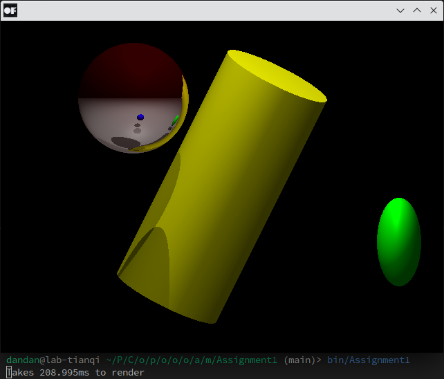
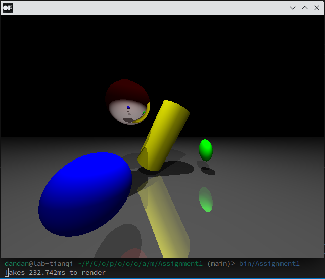
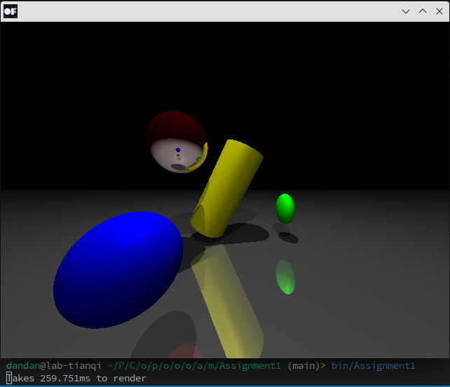
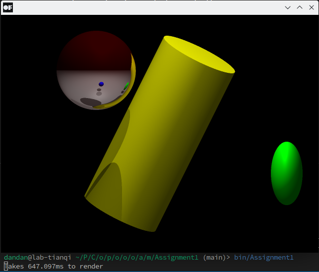

# CS248-Assignment 1

## Step to run

1. Put project directory in `openFrameworks/apps/`
2. In file `config.make`, change `OF_ROOT` to your own openframework directory.
3. `make`
4. `bin/Assignment1`

## Optional functionality

- [ ] Cone
- [x] Cylinder
- [ ] Cude
- [x] Phong shading
- [x] Mirror reflection
- [x] Multiple lights

#### Not required

- [x] MSAA
- [ ] Multi-thread

## Operation
| Key             | Operation                                          |
| --------------- | -------------------------------------------------- |
| P               | Switch between perspective and parallel projection |
| Q               | To Lambertian shading                              |
| E               | To Phong shading                                   |
| W/A/S/D/X/Space | Move camera front/Left/back/Right/Down/Up          |

## Results

Hardware: Intel Xeon Gold 6230 CPU @ 2.10GHz, 20 cores

#### Without MSAA

Parallel projection and Lambertian shading

---

Parallel projection and Phong shading

---

Perspective projection and Lambertian shading

---

Perspective projection and Phong shading

#### With 2xMSAA

Parallel projection and Lambertian shading

---

Parallel projection and Phong shading

---

Perspective projection and Lambertian shading

---

Perspective projection and Phong shading

